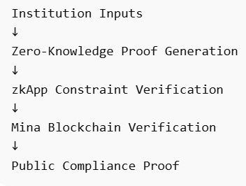

# 🧾 Zero-Knowledge Regulatory Threshold Verification (Prototype)

### Mina Protocol zkApp — Exploration Prototype
A prototype zkApp demonstrating how regulatory compliance rules can be enforced through zero-knowledge proofs instead of document-based reporting.

---

## 🧪 Project Status

This repository contains an **exploration prototype** built using
o1js on the Mina Devnet.

The goal of this project is to experiment with how regulatory
threshold conditions can be expressed as **zero-knowledge
arithmetic constraints** and verified on-chain.

This implementation focuses on:

- Constraint modeling
- zk proof generation
- Devnet verification workflow

It is **not intended as a production compliance system**, but as
a research demonstration of how regulatory verification could
be implemented using zk-native blockchain infrastructure.

## 🔍 Overview

This project demonstrates how Mina’s zk-native architecture (o1js) can enforce regulatory threshold rules using zero-knowledge smart contracts.

The prototype models a statutory accreditation requirement:

facultyCount × 20 ≥ studentCount

Institutions can generate a cryptographic proof that this threshold condition is satisfied.
The Mina blockchain verifies only the mathematical validity of the proof-not institutional documents or reporting artifacts.

This exploration focuses on constraint modeling and proof lifecycle validation (off-chain proving → on-chain verification). It illustrates how regulatory compliance can be enforced through verifiable mathematics rather than trust-based or document-driven reporting systems.


---

## 🎓 Research Motivation

This prototype explores how zero-knowledge blockchain systems can replace
document-driven regulatory reporting with cryptographic verification.

Instead of relying on institutional reports, spreadsheets, or manual audits,
compliance conditions can be encoded directly as mathematical constraints
inside zkApps. Institutions can then generate proofs that the rules are satisfied
without exposing underlying operational data.

This approach illustrates a broader shift from **trust-based compliance reporting**
to **cryptographically verifiable compliance infrastructure**.

## 🏗 Verification Flow

The prototype demonstrates a simple compliance verification lifecycle using Mina zkApps.





## 🎯 Problem

Accreditation and regulatory systems typically rely on:

- Self-reported spreadsheets  
- Manual audits  
- Document uploads  
- Trust-based verification  

This creates risks such as:

- Inflated reporting  
- Temporary compliance adjustments  
- Post-submission modification  
- Inconsistent data across departments  

This prototype replaces trust-based reporting with **mathematically enforced verification**.

---

## ⚙️ Technical Approach

The zkApp encodes the compliance rule as an arithmetic constraint:

```ts
facultyCount
  .mul(FacultyRatioZkApp.MAX_RATIO)
  .assertGreaterThanOrEqual(totalStudents);

```
 ## ⚙️ Key Characteristics

- Compliance rules are enforced purely through arithmetic constraints within the zkApp.

- No institutional documents or datasets are stored on-chain.

- The zkApp acts as a stateless mathematical verifier rather than a data storage system.

- Zero-knowledge proofs allow institutions to demonstrate compliance without revealing sensitive operational data.

- Future iterations will extend this prototype to support fully confidential witness-based inputs.

## 🛠 How to Run the Project


1. Install dependencies

```bash
npm install
```

2. Build the zkApp

```bash
npm run build
```

3. Generate and submit a proof on Mina Devnet

```bash
npm run devnet
```


## 🚀 Devnet Deployment

The zkApp has been deployed to Mina Devnet.

Deployment transaction:

https://minascan.io/devnet/tx/5Ju9NUTTLHhnnpgAsjE322us5obWMDBHHRE4x71v59Gcfr9TujnQ

✅ On-Chain Verification Examples

Multiple compliance proofs have been successfully verified on Devnet.

Sample transactions:

https://minascan.io/devnet/tx/5JuiRv1EzBsG4ZtiNL8uurDeEsdgpA61Rt2c7aYmBL4YRfyDVkQM

https://minascan.io/devnet/tx/5JtnB4MCgaBsKeKLJ2K5inPb6Rw79aLdgZk9NvjxEuAqQAAuHugG

https://minascan.io/devnet/tx/5JuKCSnnot53xJ2mbWJVQ74kVbFJzXGn6wnqGbUsx9hLbgBJKBr2

Each transaction publicly verifies compliance without exposing sensitive data.

## 📊 Feasibility Observations

Lightweight arithmetic circuit

Proof generation under practical limits on standard hardware

Devnet verification stable and publicly auditable

This validates the feasibility of zk-based regulatory threshold enforcement on Mina.

## ⛓ Why Mina Protocol?

Mina’s zk-native architecture allows smart contracts to verify
zero-knowledge proofs directly on-chain with minimal state growth.

This makes Mina particularly suitable for:

- Regulatory verification systems
- Privacy-preserving compliance checks
- Lightweight cryptographic proofs

The zkApp model enables institutions to prove compliance
without revealing sensitive operational data.

## 🔮 Future Scope

This prototype is designed as a foundational module for:

- Multi-metric accreditation verification

- Department-level compliance proofs

- Recursive aggregation of institutional compliance

- Privacy-preserving governance infrastructure